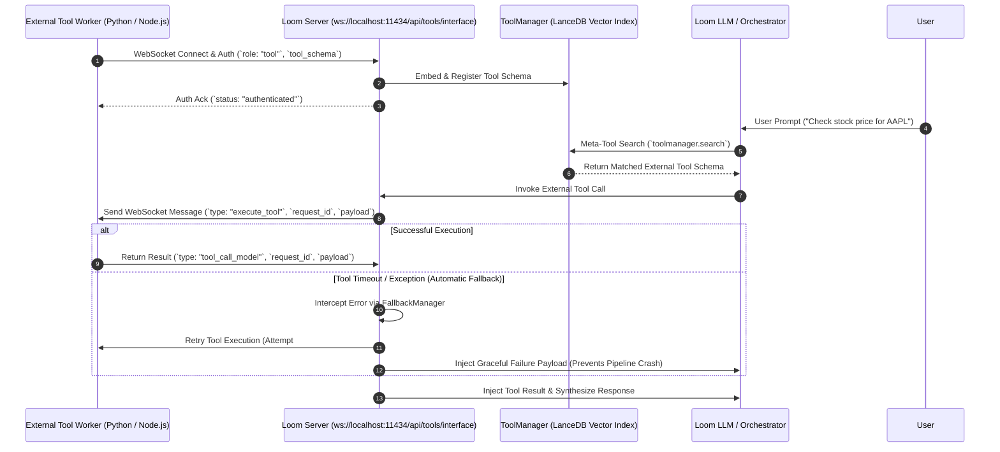

# External Tool Developer Guide: WebSocket, Dynamic Tools & Automatic Fallbacks

This guide explains how to build, register, and execute external tools with **Loom Enterprise Runtime** using the high-speed WebSocket interface (`ws://localhost:11434/api/tools/interface`), RAG vector ToolManager, and automated error fallback handling.

---

## 1. Overview of Dynamic Tool Interface

Instead of hardcoding tool schemas into client HTTP request payloads (which bloats context windows), external applications can connect persistent tool workers to Loom via WebSockets.

### Workflow Overview



---

## 2. Automatic Tool Fallback & Error Interception

Loom includes a native **Fallback Manager** (`server/fallback.go`) that ensures external tool failures never crash the conversation pipeline.

### Fallback Behavior for External Tools

1. **Automatic Retry:** If an external tool worker disconnects, times out, or returns an error, Loom automatically retries the tool execution after a brief delay.
2. **Graceful Payload Injection:** If retries fail, Loom generates a structured fallback payload back to the model:
   ```json
   {
     "status": "failed",
     "error": "Tool 'get_stock_price' execution encountered an error: connection timeout",
     "recovered_by": "fallback_system",
     "recommendation": "Acknowledge the tool issue to the user and proceed with available text context."
   }
   ```
3. **Error Audit Logging (`get_error_logs`):** Every failure and recovery event is recorded in the server's error log. Models can call `get_error_logs` to diagnose tool issues dynamically.

---

## 3. WebSocket Communication Protocol

### Connection URL
- `ws://127.0.0.1:11434/api/tools/interface`

### Step 1: Handshake & Registration Payload
Upon establishing the WebSocket connection, the external tool must send an initial registration JSON message:

```json
{
  "auth_token": "abc",
  "role": "tool",
  "tool_name": "get_stock_price",
  "priority": 10,
  "tool_schema": {
    "type": "function",
    "function": {
      "name": "get_stock_price",
      "description": "Fetch real-time stock ticker prices for a company symbol.",
      "parameters": {
        "type": "object",
        "properties": {
          "symbol": {
            "type": "string",
            "description": "The stock ticker symbol (e.g. AAPL, GOOGL, TSLA)"
          }
        },
        "required": ["symbol"]
      }
    }
  }
}
```

### Step 2: Receive Execution Request (`execute_tool`)
When Loom dispatches a tool call from a model, the worker receives:

```json
{
  "type": "execute_tool",
  "request_id": "req_987654321",
  "source_tool": "get_stock_price",
  "payload": {
    "symbol": "AAPL"
  }
}
```

### Step 3: Return Execution Result (`tool_call_model`)
The tool worker executes its logic and returns the response over the active WebSocket:

```json
{
  "type": "tool_call_model",
  "request_id": "req_987654321",
  "source_tool": "get_stock_price",
  "payload": {
    "status": "success",
    "symbol": "AAPL",
    "price": "$235.50",
    "currency": "USD"
  }
}
```

---

## 4. Production Python Implementation Example (With Fallback Error Handling)

Below is a complete, runnable Python client using `asyncio` and `websockets` with fallback error handling:

```python
import asyncio
import json
import logging
import websockets

logging.basicConfig(level=logging.INFO)
logger = logging.getLogger("LoomToolWorker")

LOOM_WS_URL = "ws://127.0.0.1:11434/api/tools/interface"
AUTH_TOKEN = "abc"

# 1. Define Tool Schema
STOCK_TOOL_SCHEMA = {
    "type": "function",
    "function": {
        "name": "get_stock_price",
        "description": "Fetch real-time stock ticker prices for a company symbol.",
        "parameters": {
            "type": "object",
            "properties": {
                "symbol": {
                    "type": "string",
                    "description": "Stock ticker symbol (e.g., AAPL, GOOGL)"
                }
            },
            "required": ["symbol"]
        }
    }
}

# 2. Tool Execution Logic with Exception Handling
def handle_stock_price(payload: dict) -> dict:
    try:
        symbol = payload.get("symbol", "").upper()
        if not symbol:
            raise ValueError("Missing 'symbol' parameter in payload")
            
        logger.info(f"Executing stock lookup for symbol: {symbol}")
        prices = {"AAPL": "$235.50", "GOOGL": "$175.20", "TSLA": "$210.00"}
        price = prices.get(symbol, "$100.00")
        
        return {"status": "success", "symbol": symbol, "price": price}
    except Exception as e:
        logger.error(f"Execution error in tool worker: {e}")
        # Return structured error payload for Loom Fallback Manager
        return {
            "status": "error",
            "error": str(e),
            "recovered_by": "tool_worker_exception_handler"
        }

# 3. Persistent Worker Loop
async def run_tool_worker():
    while True:
        try:
            logger.info("Connecting to Loom Tool Interface...")
            async with websockets.connect(LOOM_WS_URL) as ws:
                auth_msg = {
                    "auth_token": AUTH_TOKEN,
                    "role": "tool",
                    "tool_name": "get_stock_price",
                    "priority": 10,
                    "tool_schema": STOCK_TOOL_SCHEMA
                }
                await ws.send(json.dumps(auth_msg))
                
                response = await ws.recv()
                logger.info(f"Connected & Registered: {response}")

                async for message in ws:
                    data = json.loads(message)
                    if data.get("type") == "execute_tool":
                        req_id = data.get("request_id")
                        payload = data.get("payload", {})
                        
                        result = handle_stock_price(payload)
                        
                        reply = {
                            "type": "tool_call_model",
                            "request_id": req_id,
                            "source_tool": "get_stock_price",
                            "payload": result
                        }
                        await ws.send(json.dumps(reply))
                        
        except (websockets.ConnectionClosed, Exception) as e:
            logger.warning(f"Connection lost ({e}). Reconnecting in 3s...")
            await asyncio.sleep(3)

if __name__ == "__main__":
    asyncio.run(run_tool_worker())
```
