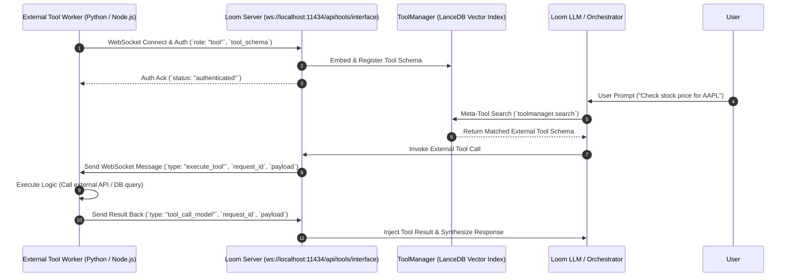

# External Tool Developer Guide: WebSocket & Dynamic Tool Integration

This guide explains how to build, register, and execute external tools with **Loom Enterprise Runtime** using the high-speed WebSocket interface (`ws://localhost:11434/api/tools/interface`) and RAG vector ToolManager.

---

## 1. Overview of Dynamic Tool Interface

Instead of hardcoding tool schemas into client HTTP request payloads (which bloats context windows), external applications can connect persistent tool workers to Loom via WebSockets.

### Workflow Overview



---

## 2. WebSocket Communication Protocol

### Connection URL
- `ws://127.0.0.1:11434/api/tools/interface`

### Step 1: Handshake & Registration Payload
Upon establishing the WebSocket connection, the external tool must send an initial registration JSON message:

```json
{
  "auth_token": "abc",
  "role": "tool",
  "tool_name": "get_stock_price",
  "priority": 10,
  "tool_schema": {
    "type": "function",
    "function": {
      "name": "get_stock_price",
      "description": "Fetch real-time stock ticker prices for a company symbol.",
      "parameters": {
        "type": "object",
        "properties": {
          "symbol": {
            "type": "string",
            "description": "The stock ticker symbol (e.g. AAPL, GOOGL, TSLA)"
          }
        },
        "required": ["symbol"]
      }
    }
  }
}
```

### Step 2: Receive Execution Request (`execute_tool`)
When Loom dispatches a tool call from a model, the worker receives:

```json
{
  "type": "execute_tool",
  "request_id": "req_987654321",
  "source_tool": "get_stock_price",
  "payload": {
    "symbol": "AAPL"
  }
}
```

### Step 3: Return Execution Result (`tool_call_model`)
The tool worker executes its logic and returns the response over the active WebSocket:

```json
{
  "type": "tool_call_model",
  "request_id": "req_987654321",
  "source_tool": "get_stock_price",
  "payload": {
    "status": "success",
    "symbol": "AAPL",
    "price": "$235.50",
    "currency": "USD"
  }
}
```

---

## 3. Production Python Implementation Example

Below is a complete, runnable Python client using `asyncio` and `websockets` to register an external tool worker:

```python
import asyncio
import json
import logging
import websockets

logging.basicConfig(level=logging.INFO)
logger = logging.getLogger("LoomToolWorker")

LOOM_WS_URL = "ws://127.0.0.1:11434/api/tools/interface"
AUTH_TOKEN = "abc"

# 1. Define Tool Schema
STOCK_TOOL_SCHEMA = {
    "type": "function",
    "function": {
        "name": "get_stock_price",
        "description": "Fetch real-time stock ticker prices for a company symbol.",
        "parameters": {
            "type": "object",
            "properties": {
                "symbol": {
                    "type": "string",
                    "description": "Stock ticker symbol (e.g., AAPL, GOOGL)"
                }
            },
            "required": ["symbol"]
        }
    }
}

# 2. Tool Execution Logic
def handle_stock_price(payload: dict) -> dict:
    symbol = payload.get("symbol", "").upper()
    logger.info(f"Executing stock lookup for symbol: {symbol}")
    
    # Mock data lookup (replace with actual API call)
    prices = {"AAPL": "$235.50", "GOOGL": "$175.20", "TSLA": "$210.00"}
    price = prices.get(symbol, "$100.00")
    
    return {"status": "success", "symbol": symbol, "price": price}

# 3. Persistent Worker Loop
async def run_tool_worker():
    while True:
        try:
            logger.info("Connecting to Loom Tool Interface...")
            async with websockets.connect(LOOM_WS_URL) as ws:
                # Send Auth & Schema
                auth_msg = {
                    "auth_token": AUTH_TOKEN,
                    "role": "tool",
                    "tool_name": "get_stock_price",
                    "priority": 10,
                    "tool_schema": STOCK_TOOL_SCHEMA
                }
                await ws.send(json.dumps(auth_msg))
                
                response = await ws.recv()
                logger.info(f"Connected & Registered: {response}")

                # Listen for tool calls
                async for message in ws:
                    data = json.loads(message)
                    if data.get("type") == "execute_tool":
                        req_id = data.get("request_id")
                        payload = data.get("payload", {})
                        
                        # Execute
                        result = handle_stock_price(payload)
                        
                        # Send Reply
                        reply = {
                            "type": "tool_call_model",
                            "request_id": req_id,
                            "source_tool": "get_stock_price",
                            "payload": result
                        }
                        await ws.send(json.dumps(reply))
                        
        except (websockets.ConnectionClosed, Exception) as e:
            logger.warning(f"Connection lost ({e}). Reconnecting in 3s...")
            await asyncio.sleep(3)

if __name__ == "__main__":
    asyncio.run(run_tool_worker())
```

---

## 4. Production Node.js / JavaScript Example

```javascript
const WebSocket = require('ws');

const LOOM_WS_URL = 'ws://127.0.0.1:11434/api/tools/interface';

function connectToolWorker() {
  const ws = new WebSocket(LOOM_WS_URL);

  ws.on('open', () => {
    console.log('Connected to Loom WebSocket');
    
    ws.send(JSON.stringify({
      auth_token: 'abc',
      role: 'tool',
      tool_name: 'calculate_tax',
      tool_schema: {
        type: 'function',
        function: {
          name: 'calculate_tax',
          description: 'Calculate sales tax for an amount',
          parameters: {
            type: 'object',
            properties: {
              amount: { type: 'number' },
              rate: { type: 'number' }
            },
            required: ['amount']
          }
        }
      }
    }));
  });

  ws.on('message', (message) => {
    const data = JSON.parse(message);
    if (data.type === 'execute_tool') {
      const { amount, rate = 0.08 } = data.payload;
      const tax = amount * rate;
      
      ws.send(JSON.stringify({
        type: 'tool_call_model',
        request_id: data.request_id,
        source_tool: 'calculate_tax',
        payload: { amount, tax, total: amount + tax }
      }));
    }
  });

  ws.on('close', () => {
    console.log('Connection closed. Reconnecting...');
    setTimeout(connectToolWorker, 3000);
  });
}

connectToolWorker();
```
