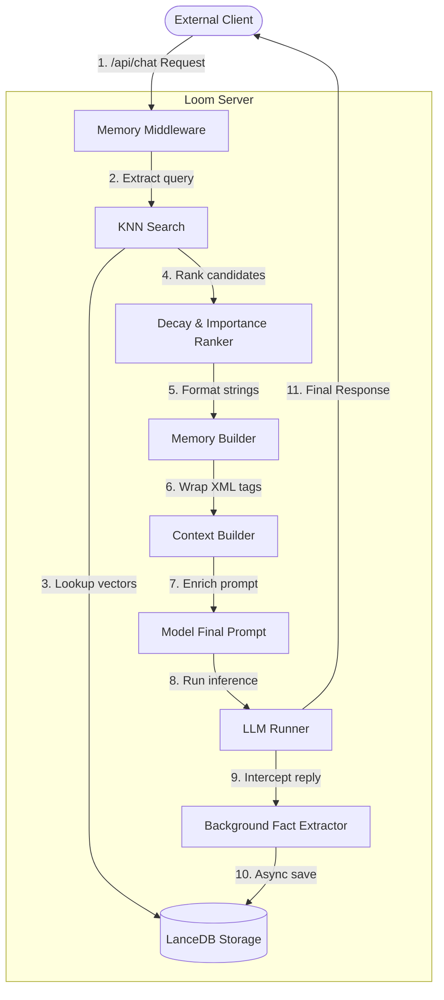

# Loom Long-Term Memory System: Integration & Communication Contract

This document specifies the contract and communication protocol for external tools, API clients, and scripts (such as [chat.py](file:///home/master/Desktop/loom-master/chat.py) and [test.py](file:///home/master/Desktop/loom-master/test.py)) integrating with Loom's native long-term memory subsystem.

---

## 1. High-Level Architectural Pipeline

The memory subsystem intercepts standard `/api/chat` requests and responses via a server middleware. The data flow follows this pipeline:



---

## 2. API Communication Protocol

External clients interact with the memory-enriched server using standard Loom API requests. No special headers are required to activate memory, provided it is enabled in the configuration.

### A. Identification and Multi-User Setup
By default, the memory engine keys memories by the **client's remote IP address**.
To support multi-user environments:
- Enable Token Authentication in `~/.loom/server.json`.
- Send the `Authorization: Bearer <token>` header in all HTTP requests.

### B. Standard Chat Payload (`/api/chat`)
Clients request chats normally. The memory system operates transparently behind the scenes:

```json
{
  "model": "deepseek-r1-llama-8b-uncensored",
  "messages": [
    {
      "role": "user",
      "content": "Hi, I am working on building a Go microservice named Zephyr."
    }
  ],
  "stream": true
}
```

### C. Direct Memory Access Tools (Function Calling)
If the model template has `CapabilityTools` enabled, the server automatically appends memory management tools to the client's requested tools list. The model can choose to call these tools to interact with the database directly.

#### Tool Definitions:

| Tool Name | Parameters | Purpose |
| :--- | :--- | :--- |
| `save_memory` | `content` (str), `type` (enum), `tags` (array of str) | Saves a new fact explicitly to the database. |
| `list_memories` | `type` (enum), `pinned` (bool), `archived` (bool) | Searches and filters saved memories. |
| `delete_memory` | `id` (str) | Deletes a memory by its unique identifier. |
| `save_special_memory` | `key` (str), `value` (str) | Stores AI-managed custom key-value pairs. |
| `list_special_memories` | *None* | Lists all items in the AI's special memory table. |
| `delete_special_memory` | `id` (str) | Deletes a special memory item by ID. |

> [!NOTE]
> Tool execution is intercepted and handled entirely by the server. If the model invokes a memory tool, the server runs it against the local LanceDB store, appends the result to the history, and internally resumes the chat round before streaming back to the client.

---

## 3. Storage and Data Representation

Memory is persisted in a local directory formatted as a columnar LanceDB store:
- **Default Database Path:** `~/.loom/memory.lance` (configurable via `memory.db_path` in `server.json`).
- **Embedding Dimensions:** Determined by the configured model (e.g., `768` dimensions for `nomic-embed-text`).

### Memory Document Schema (JSON representation):
```json
{
  "id": "uuid-v4-string",
  "user_id": "remote-ip-or-auth-token-id",
  "type": "user | project | conversation | episodic | semantic",
  "content": "My name is Tuhin and I code in Go",
  "summary": "User prefers Go",
  "importance": 0.85,
  "embedding": [0.012, -0.045, 0.108, "..."],
  "tags": ["personal", "go"],
  "access_count": 3,
  "pinned": false,
  "archived": false,
  "created_at": "2026-07-27T22:00:00Z",
  "updated_at": "2026-07-27T22:00:00Z",
  "last_accessed": "2026-07-27T22:15:30Z"
}
```

---

## 4. Server Configuration (`~/.loom/server.json`)

To configure the memory subsystem, edit or create `~/.loom/server.json` on the host machine:

```json
{
  "api_token": "loom-secret-token-123",
  "memory": {
    "enabled": true,
    "db_path": "/home/master/.loom/memory.lance",
    "embedding_model": "nomic-embed-text",
    "top_k": 20,
    "similarity_threshold": 0.65,
    "importance_threshold": 0.3,
    "decay_rate": 0.01,
    "max_prompt_memories": 10,
    "max_prompt_tokens": 2048
  }
}
```

---

## 5. Memory Decay and Archival Algorithm

The system applies exponential time decay to the relevance of non-pinned memories:

$$\text{importance}_{\text{new}} = \text{importance}_{\text{stored}} \times e^{-\text{decay\_rate} \times \text{days\_since\_last\_access}}$$

- **Pinned Status:** Pinned memories (`pinned: true`) are immune to decay.
- **Access Boost:** Querying a memory increments its `access_count` and updates its `last_accessed` timestamp, which increases its retrieval ranking.
- **Archival:** Background workers periodically run to hide memories whose importance falls below the `importance_threshold`.
